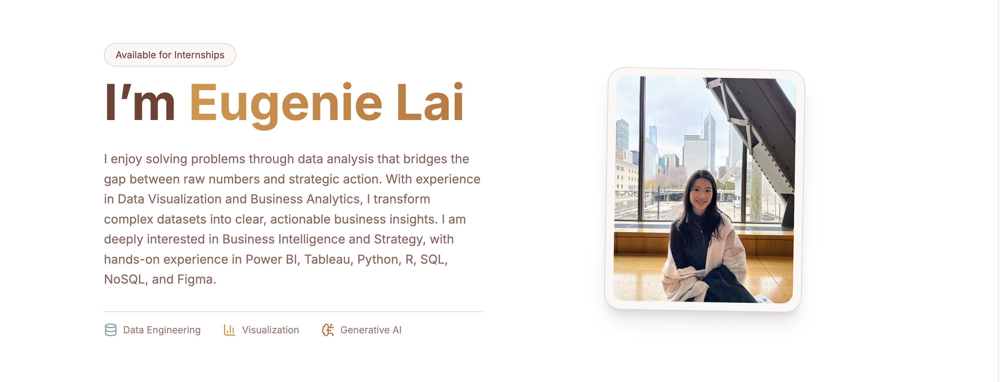

# Eugenie Lai — Data & Strategy Portfolio

This repository contains the source code for my personal portfolio website, showcasing selected projects in **Business Intelligence, Data Analytics, Strategy, Finance, and UI/UX design**.

🌐 **Live site**: https://eugenie1708.github.io  
📍 **Currently**: MS in Business Analytics  
🎯 **Focus**: Turning data into strategic action

---

## About This Project

This portfolio website was built with the help of **Google AI Studio**, which assisted in generating the initial code structure and development setup.

I then personally:
- organized and curated all project content
- structured the portfolio sections
- designed the layout and visual hierarchy
- customized the color system and styling

The goal of this portfolio is to present selected work in **data analytics, business intelligence, and strategy**, and demonstrate how I translate data into actionable insights.

---

© 2026 Eugenie Lai